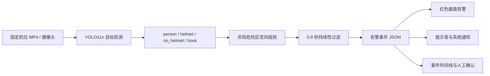

# 联通智安：工厂吊装区域安全帽监测 Demo

本项目使用固定监控摄像头视频和轻量级 YOLO11n 模型，识别 `person`、`helmet`、`no_helmet`、`hook` 四类目标。当吊钩下方或周边危险区域出现 `no_helmet` 时，系统生成高风险事件，并在中国联通红白主题网页中进行画面、声音和浏览器通知提醒。

当前版本定位为轻量化演示和方案验证，不应直接替代工厂正式安全联锁系统。

## 一键打开演示网页

在 Windows 资源管理器中双击根目录下的：

```text
start_web_demo.bat
```

脚本会自动：

1. 检查 `http://localhost:3000` 是否已经运行本项目；
2. 首次启动且缺少 `node_modules` 时执行 `npm install`；
3. 在后台启动网页服务，并等待页面可访问；
4. 自动使用默认浏览器打开演示网页。

也可以在 PyCharm Terminal 或 PowerShell 中执行：

```powershell
.\scripts\start_web_demo.ps1
```

首次演示时，点击网页右上角的“开启通知”，并允许浏览器发送系统通知。

## 系统工作流程



当前网页使用预先完成识别标注的视频进行展示，浏览器负责播放视频、同步告警时间线和发送通知；YOLO 推理及事件提取由 Python 脚本离线完成。这种结构便于稳定演示，但不是浏览器端实时推理。

## 技术栈

| 模块 | 技术 | 用途 |
| --- | --- | --- |
| 目标检测 | PyTorch 2.2.2、Ultralytics 8.3.0、YOLO11n | 四类别目标检测 |
| 图像与视频 | OpenCV 4.x | 视频读取、逐帧推理、检测结果绘制 |
| GPU 环境 | CUDA 12.1、RTX 3070 Ti Laptop GPU | 模型训练和测试 |
| 规则引擎 | Python | 吊钩与未戴安全帽目标的空间、时间关联 |
| 演示网页 | React 19、TypeScript、Vinext/Vite | 监控大屏、事件同步和交互 |
| 通知 | Web Notification API、Web Audio API | 系统通知和告警提示音 |
| 视频交付 | H.264、1280×720、25 FPS、fast-start | 浏览器兼容和快速加载 |

## 数据集与训练方案

所有数据来自同一固定监控角度，以 0.5 FPS（每两秒一张）抽帧。初始 4 分钟视频提供训练、验证、测试和演示片段；随后加入同机位 13 分钟视频中的 80 张已标注图像，用于加强目标学习。

| 数据划分 | 图像数 | person 框 | helmet 框 | no_helmet 框 | hook 框 |
| --- | ---: | ---: | ---: | ---: | ---: |
| 训练集 | 156 | 792 | 47 | 726 | 128 |
| 验证集 | 15 | 71 | 15 | 53 | 15 |
| 测试集 | 15 | 70 | 15 | 54 | 15 |

训练配置：

- 预训练权重：`yolo11n.pt`
- 输入尺寸：960×960
- 最大训练轮数：80，实际在第 73 轮因早停结束
- Batch Size：2
- Early Stopping Patience：12
- AMP 混合精度训练：开启
- 数据增强：HSV、平移、缩放、水平翻转和 Mosaic
- 最佳权重：`models/best.pt`，约 5.49 MB

## 最终模型质量

### 验证集最佳轮次

按照 Ultralytics 综合 fitness 选择，第 61 轮表现最佳：

| Precision | Recall | mAP50 | mAP50-95 |
| ---: | ---: | ---: | ---: |
| 90.7% | 88.4% | 93.4% | 52.4% |

### 独立测试集

最终 `models/best.pt` 在 15 张、154 个目标实例的测试集上重新评估，参数为 `imgsz=960`、`batch=2`：

| 类别 | Precision | Recall | mAP50 | mAP50-95 |
| --- | ---: | ---: | ---: | ---: |
| person | 85.1% | 87.1% | 92.2% | 54.9% |
| helmet | 90.2% | 93.3% | 95.9% | 43.6% |
| no_helmet | 93.8% | 84.1% | 93.1% | 46.8% |
| hook | 93.3% | 46.7% | 51.4% | 23.8% |
| **总体** | **90.6%** | **77.8%** | **83.1%** | **42.3%** |

结果解读：

- `helmet` 与 `no_helmet` 的 mAP50 均超过 93%，在当前固定机位下已经具备较好的 Demo 展示效果。
- `hook` 的 Precision 为 93.3%，说明模型一旦报出吊钩通常较可靠；但 Recall 只有 46.7%，约一半真实吊钩可能漏检，是当前系统的主要瓶颈。
- 总体 mAP50 为 83.1%，可用于轻量化演示；mAP50-95 为 42.3%，说明严格框定位仍有明显提升空间。
- 测试集只有 15 张图片，并且与训练集来自相同机位和相邻视频，指标可能偏乐观，不能代表跨厂区、跨摄像头的泛化能力。

在本机 RTX 3070 Ti Laptop GPU 上，本次测试测得平均推理耗时约 44.1 ms/图。该数字不包含完整的视频解码、规则计算、绘制和通知开销，只适合作为模型推理参考。

## 告警规则

事件分析脚本以吊钩框中心为参照：

- 水平方向：`no_helmet` 中心与吊钩中心距离不超过 420 像素；
- 垂直方向：允许吊钩上方 80 像素至下方 780 像素；
- 最短持续时间：违规连续出现至少 0.8 秒；
- 合并间隔：短于 0.8 秒的漏检间隔合并为同一事件；
- 模型最低置信度：0.20。

这些参数针对当前 1920×1080 固定机位设置。正式部署时应改为按画面比例或可配置多边形 ROI，并根据吊钩尺度动态调整危险区。

## 一分钟演示结果

演示输入为 `data/raw_videos/demo_video.mp4`。网页使用 H.264 1280×720 视频，体积从约 121 MB 压缩到约 11.8 MB。

事件分析生成 4 个候选告警区间。页面过滤视频起始处 0.0–0.8 秒的边界候选，主要展示以下 3 个告警：

| 时间区间 | no_helmet 最高置信度 | hook 最高置信度 |
| --- | ---: | ---: |
| 11.4–40.0 秒 | 93% | 91% |
| 48.2–49.2 秒 | 84% | 84% |
| 52.6–59.8 秒 | 94% | 89% |

网页可同步显示危险区红框、告警横幅、人员状态、事件时间线，并支持跳转到告警时刻和人工确认。

## 常用命令

安装 Python 依赖（PyTorch 已单独安装）：

```powershell
C:\Python\Python312\python.exe -m pip install -r requirements.txt
```

重新准备扩展数据集并训练：

```powershell
C:\Python\Python312\python.exe -m scripts.prepare_extended_dataset
C:\Python\Python312\python.exe -m scripts.train_demo `
  --data data\datasets\helmet_light_v2\helmet.yaml `
  --epochs 80 --imgsz 960 --batch 2 --device 0 --name light_demo_v2
```

重新分析演示视频：

```powershell
C:\Python\Python312\python.exe scripts\analyze_hook_safety.py `
  --model models\best.pt `
  --source data\raw_videos\demo_video.mp4 `
  --output web-demo\public\events.json
```

检查网页：

```powershell
cd web-demo
npm run lint
npm run build
```

## 项目结构

```text
unicom/
├─ app/                         # Python 检测应用与规则状态机
├─ configs/                     # 数据集、应用和检测区域配置
├─ data/                        # 原始视频、数据集与标签（不提交 Git）
├─ models/best.pt               # 最终权重（不提交 Git）
├─ scripts/
│  ├─ prepare_extended_dataset.py
│  ├─ train_demo.py
│  ├─ analyze_hook_safety.py
│  └─ start_web_demo.ps1        # 网页自动启动脚本
├─ web-demo/
│  ├─ app/page.tsx              # 演示主页面与通知逻辑
│  ├─ app/globals.css           # 中国联通红白主题
│  └─ public/                   # H.264 视频、事件 JSON、字幕和分享图
├─ start_web_demo.bat           # Windows 双击入口
└─ requirements.txt
```

## 当前局限与优化优先级

1. **优先补充吊钩样本**：增加远距离、小尺寸、遮挡、运动模糊和不同吊钩姿态，重点提升 `hook` Recall。
2. **避免连续帧数据泄漏**：后续应按完整视频片段或日期划分训练与测试，而不是从相邻时间帧拆分。
3. **增加负样本**：加入没有吊钩、复杂机械结构、红色或弯曲物体的画面，降低误检风险。
4. **加入跨场景测试**：正式使用前至少覆盖不同光照、班次、天气、摄像头距离与遮挡情况。
5. **升级空间关系**：把固定像素矩形升级为可视化多边形 ROI，并将 `person`、头部安全帽状态和 `hook` 通过跟踪 ID 关联。
6. **接入真实通知渠道**：生产环境可增加企业微信、短信、声光报警器或现场 PLC；当前浏览器通知仅适合演示。

## 安全说明

本系统属于辅助监测工具。模型可能发生漏检和误检，尤其是吊钩较小、被遮挡或画面模糊时。生产部署必须保留人工监督，并经过现场验收、误报漏报统计和安全责任评审。